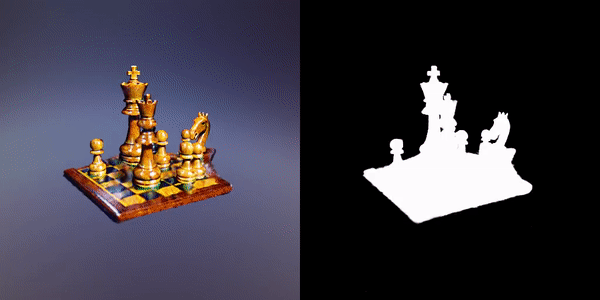
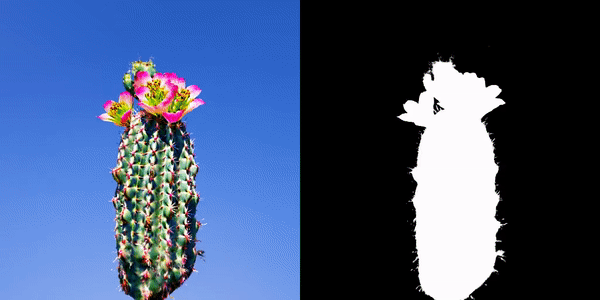
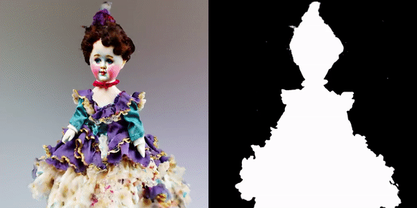
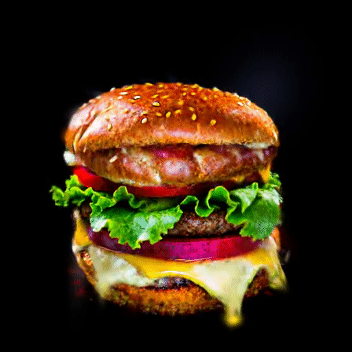
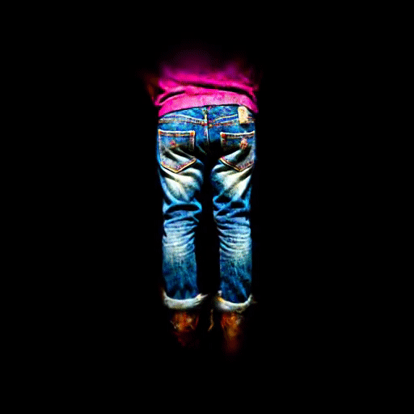
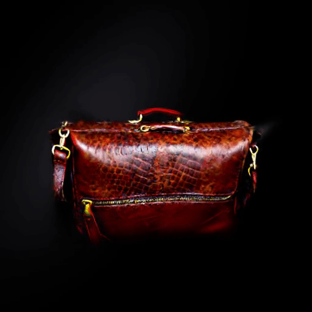

<div class="columns is-centered has-text-centered">
    <div class="column is-four-fifths">
        <h2>Abstract</h2>
        <div class="content has-text-justified">
Recent works on text-to-3d generation show that using only 2D diffusion supervision for 3D generation tends to produce results with inconsistent appearances (e.g., faces on the back view) and inaccurate shapes (e.g., animals with extra legs). Existing methods mainly address this issue by retraining diffusion models with images rendered from 3D data to ensure multi-view consistency while struggling to balance 2D generation quality with 3D consistency. In this paper, we present a new framework Sculpt3D that equips the current pipeline with explicit injection of 3D priors from retrieved reference objects without re-training the 2D diffusion model. Specifically, we demonstrate that high-quality and diverse 3D geometry can be guaranteed by keypoints supervision through a sparse ray sampling approach. Moreover, to ensure accurate appearances of different views, we further modulate the output of the 2D diffusion model to the correct patterns of the template views without altering the generated object's style. These two decoupled designs effectively harness 3D information from reference objects to generate 3D objects while preserving the generation quality of the 2D diffusion model. Extensive experiments show our method can largely improve the multi-view consistency while retaining fidelity and diversity.        </div>
    </div>
</div>


## Performance on T3Bench


| Dataset      | Dreamfusion | Magic3D | LatentNeRF | Fantasia3D |  ProlificDreamer | **Ours-Sculpt3D**|
|:------------:|:-----------:|:-------:|:----------:|:----------:|:---------------:|:-----------------:|
| Quality      |     24.9    |   38.7  |    34.2    |    29.2    |     51.1        |     **53.6**      |  
| Alignment    |     24.0    |   35.3  |    32.0    |    23.5    |     47.8        |     **49.3**      |  
| Cons. Rate   |      34%    |    38%  |     30%    |     26%    |     32%         |      **76%**      |  

We achieve state-of-the-art performance on T3Bench. We manually identify and count 3D inconsistencies (e.g., multiple faces, legs, and other distorted shapes.) to calculate the consistent rate of each method. 

## Generation Results (NeRF)

<table style="border: none;">
  <tr>
    <td style="text-align: center;">
    <video width="720" height="303" controls>
    <source src="static/image/small_saguaro_cactus_1.mp4" type="video/mp4">
    </video>
      <br><em>small saguaro cactus</em>
    </td>
    <td style="text-align: center;">
      
      <br><em>An intricately-carved wooden chess set</em>
    </td>
  </tr>
  <tr>
    <td style="text-align: center;">
      
      <br><em>A cactus with pink flowers</em>
    </td>
    <td style="text-align: center;">
      
      <br><em>A vintage porcelain doll with a frilly dress</em>
    </td>
  </tr>
</table>

## Generation Results (3D Gaussian Splatting)

<table style="border: none;">
  <tr>
    <td style="text-align: center;">
      
      <br><em>A DSLR image of a hamburger</em>
    </td>
    <td style="text-align: center;">
      
      <br><em>A pair of worn-in blue jeans</em>
    </td>
  </tr>
  <tr>
    <td style="text-align: center;">
      
      <br><em>A worn-out leather briefcase</em>
    </td>
    <td style="text-align: center;">
      
      <br><em>An ivory candlestick holder</em>
    </td>
  </tr>
</table>


## Citation
```
@article{yang2023lods,
  title={Learn to Optimize Denoising Scores for 3D Generation},
  author={Xiaofeng Yang, Yiwen Chen, Cheng Chen, Chi Zhang, Yi Xu, Xulei Yang, Fayao Liu and Guosheng Lin},
  journal={arXiv:2312.04820},
  year={2023}
}
```
